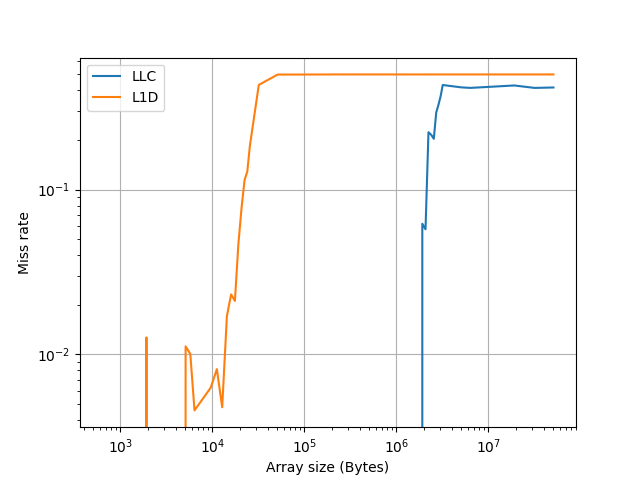

# Cyclops

A minimal microbenchmarking tool for Linux build directly on top of 
`perf_event_open()` and timers like `rdtscp`.

## Motivation

I built **cyclops** because I wanted a small, accurate microbenchmarking
framework for measuring C code.

## Features

- Workload plugin system to easily write custom workloads (see
  `docs/workload.md`)
    - Workloads can have custom parameters - useful for experiments where you
      vary an array size (for example)
- Groups of metrics to record for a given workload (see `docs/metrics.md`)
    - Metric groups for `perf_event_open()` counters and `rdtscp`
    - Ratios like IPC (instructions per cycle) calculated per-run
- Batches allowing the user to set the number of warmup runs, batch runs,
  workload and metric group
    - Aggregates (min, max & median) are calculated for the batch
- Results are written to stdout (aggregate summary) & optionally a CSV file
    - User decides whether CSV contains aggregates or per-run data
    - CSVs contain metadata (lines starting with "#")

## Build and Run

```bash
# clone repository
git clone https://mj-penney/cyclops.git cyclops

# enter repository
cd cyclops

# build
make

# run
./cyclops -w STRIDED_ARRAY -m IPC -p array-elements=1000
```

## Example Usage

Run the `STRIDED_ARRAY` workload, measuring the `IPC` metric group and write
output to `output.csv`.
The batch will have 20 runs (`-r`), and there will be 10 warmup runs (`-u`).

```bash

./cyclops -u 10 -r 20 -w STRIDED_ARRAY -m IPC -o output.csv
```

## Experiments

The `cyclops` tool is designed to be highly scriptable, and make it easy to
design performance & microarchitecture experiments.

In `experiments/` there are example Python scripts for running experiments.
To run these experiments, you will first need to build the `cyclops` binary
(see above).

You will then need to create a Python virtual environment and install the
necessary packages:

```bash
cd experiments
python -m venv venv
pip install -r requirements.txt
```

Before running the example experiments, activate the virtual environment you
just created:

```bash
source venv/bin/activate
```

Check the example experiments below for inspiration.

### L1 Cache and LLC Size Estimation

This experiment uses the `STRIDED_ARRAY` workload, sweeping through increasing
array sizes, to estimate L1D and LLC capacities from cache miss rates.

This experiment can be run with:

```bash
python estimate_cache_size.py
```

#### Results



As the array size increases, and exceeds the size of a cache, the cache can no
longer hold all the data.
Some will need to be fetched from other caches or DRAM, resulting in an
increase in the cache miss rate at this point.

Here we can see that there is a large jump in the L1D miss rate when the array
is between 2\*10^4 and 4\*10^4 Bytes, and a large jump in LLC miss rate
between 2\*10^6 and 3\*10^6.

These ranges align with the actual cache sizes for my CPU:

- **L1D:** 32KiB per physical core
- **L3:** 3MiB

## Project Roadmap

### Milestone 1 - Reliable single-threaded benchmarking

- single-threaded measurement accuracy & reliability
- a simple cli tool allowing users to design benchmark experiments
- a simple workload API so users can measure custom code

### Milestone 2 - Multithreaded update

- support multithreaded workloads
- accurate per-thread metrics
